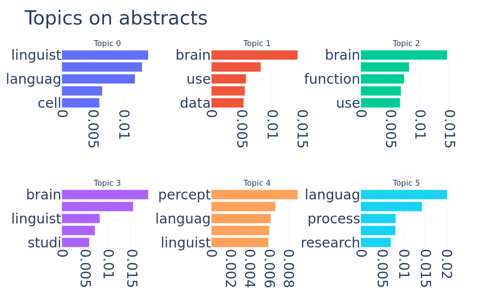

# Topic modeling on scientific abstracts and titles

This is the repo used for the paper,
"Topic modeling on scientific abstracts and titles".
For complete reproducibility of the plots and results in the paper
follow the steps in "Running the code".


The organization of the project is as follows:


```
├── README.md                  <- The top-level README for this project.
├── ReadMe_figures             <- Folder for the figures used in the ReadMe
|   └── ...
├── scripts                    <- The main folder for scripts
|   └── ...
├── data                       <- The folder with data for repreducable results
|   └── ...
├── requirements.txt           <- A requirements file of the required packages.
└── run.sh                     <- A Bash-script to run the whole analysis in a virtual enviroment

```


## Running the code

To rerun the whole analysis from the paper simply type the following code in the termial:
This code will install all requirements and use the data gathered from semantic scholar inside the data-folder. 

```bash
bash run.sh
```

#
If you wish to perform these steps manually, and or don't want to run the appendix analysis, then you should first update pip and install the requirements:

```
pip install --upgrade pip
pip install -r requirements.txt
```

If you are on a linux system you might need to run these lines before install the requirements:
```
sudo apt-get update 
sudo apt-get install python3-dev
```


Then, you can reproduce the experiments by running:

```
python scripts/Main_analysis.py
```

Finally, if you don't want to run the appendix you can do:
```
python scripts/Main_analysis.py -a 0
```

Run `python ner/main.py --help` for all optional arguments.


### Running other experiments
To run other experiments than the one presented in the paper, users have to visit https://www.semanticscholar.org/ and request an API key
which has to be entered into the key argument in the get_data function.


## importing data
importing abstracts or titles are performed by the function "get_data"
So to extract 500 abstracts and titles (per search word) from the year 2000 until today with the keywords specified in queries. 

```python
from scripts.utility_funtions import *
#insert API-key here:
key = ""

data = get_data(queries = "Homeostasis, Perception, Brain, Natural Language Processing, linguistics",
                key = key,
                n_articles = 500,
                year = 2000)

```

## Determining hyperparameters for BERTopic
To find sensible hyperparameters for BERTopic for either abstracts or titles simply get the 2D projections
form UMAP using the following code (this is for abstracts)
To make the code reproducible include random = False
```python
from scripts.BERT_utility import *

proj = get_umap(data, analysis = "abstracts", random = False)
```


To determine the cluster size use the function determin_clustersize, which takes a list of cluster_sizes as arguments and plot the resulting clustering.

```python
determin_clustersize(proj, cluster_size = [16])
```


           


To run the whole BERTopic that uses combines these steps with cluster-based term freqency inverse document freqency (c tf-idf).

```python 
topic, prob, Bertopic_model = fitter(data,
                                    analysis = "abstracts",
                                    umap_dim = 2,
                                    min_cluster = 16,
                                    random = False)
```

### Visualizing the topics
Now to visualize the results as a barchart, the following code can be run

```python 
Bertopic_model.visualize_barchart()
```


### To get the dynamic topic representation:

```python 

topics_over_time = Bertopic_model.topics_over_time(data["abstracts"], data["years"])
Bertopic_model.visualize_topics_over_time(topics_over_time)
```


## Running other experiments with LDA
To run topic modeling on the same data using the LDA framework:

```python 
from scripts.LDA_utility import * 
fig, lda_model = run_LDA(data, 6, analysis = "abstracts", save_plot = False, bow = 1, alpha = "auto", random = True):
```

